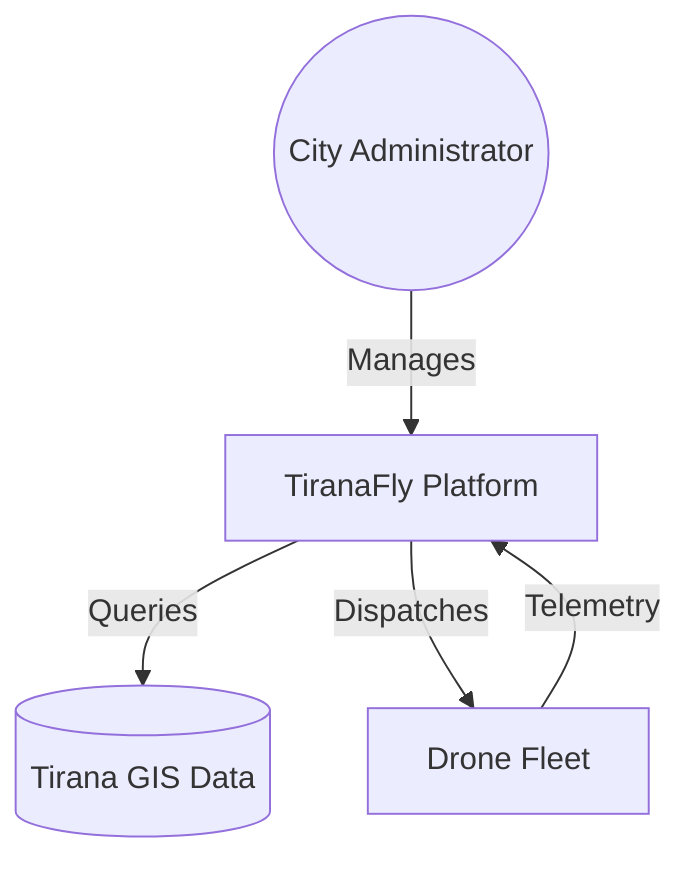
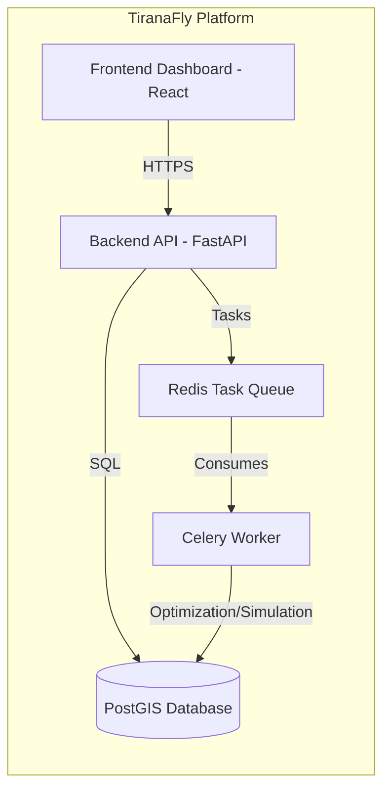
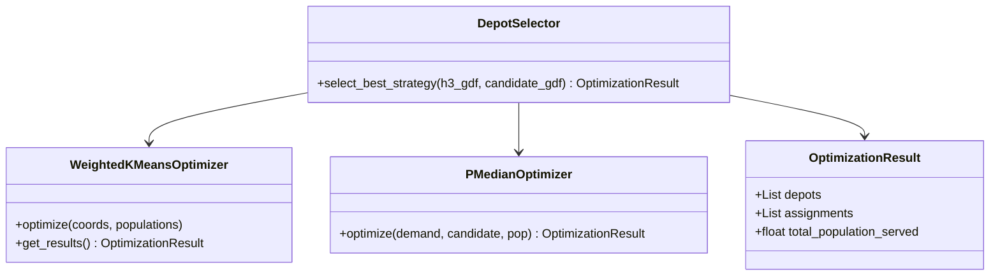
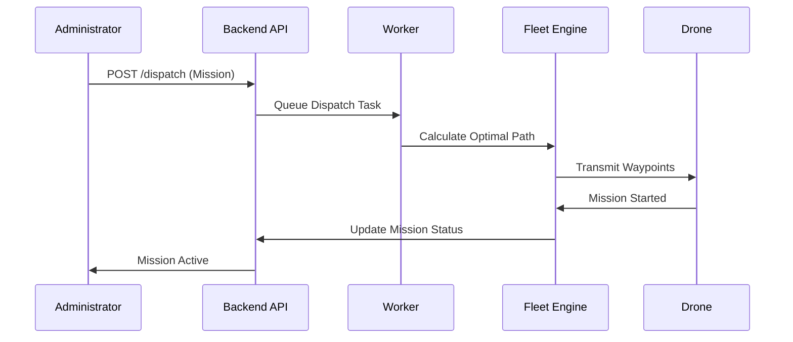

# TiranaFly: System Architecture & UML

## 1. System Context Diagram (C1)

## 2. Container Diagram (C2)

## 3. Class Diagram - Core Optimization Engine

## 4. Sequence Diagram - Mission Dispatch

